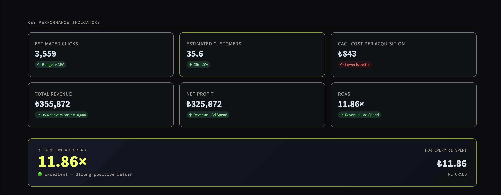
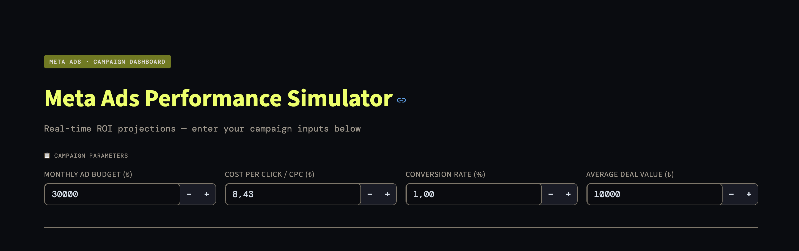
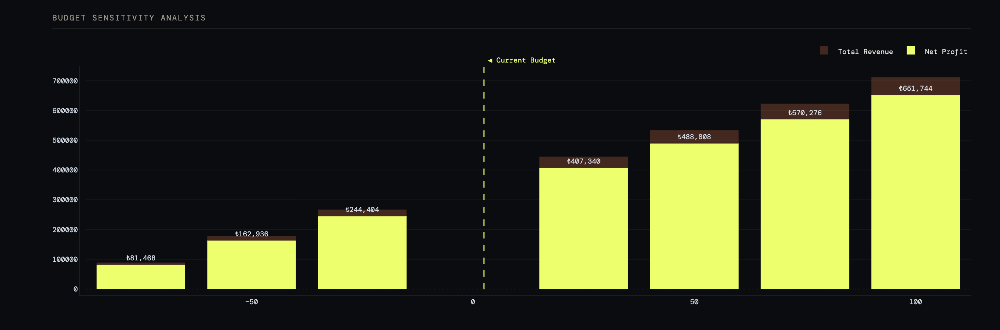
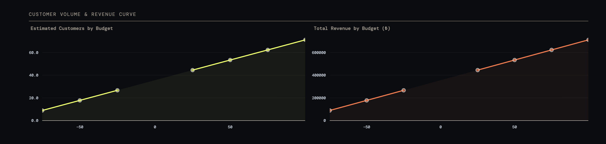
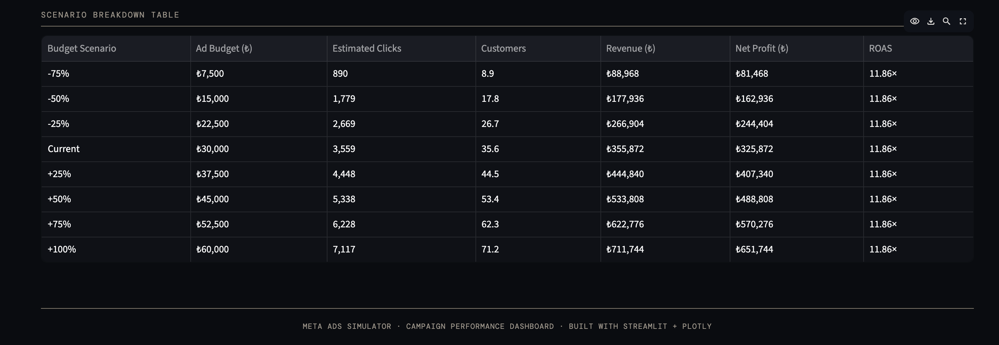

# 📊 Meta Ads Performance Simulator

A lightweight, interactive web dashboard built with **Streamlit** and **Plotly** to simulate Meta (Facebook/Instagram) ad campaign performance in real time. Enter your campaign parameters and instantly see projected KPIs, profitability, and budget sensitivity analysis.

---

## Screenshots

### Overview


### Campaign Inputs & KPI Cards


### Budget Sensitivity Analysis


### Customer Volume & Revenue Curves


### Scenario Breakdown Table


---

## Features

- **Real-time KPI calculations** — Estimated clicks, customers, CAC, revenue, net profit, and ROAS update instantly as you type
- **ROAS card** — Visual profitability verdict (Excellent / Profitable / Unprofitable) with per-₺ return breakdown
- **Budget Sensitivity Analysis** — Bar chart showing how net profit and revenue change from -75% to +100% of your current budget
- **Customer & Revenue curves** — Line charts visualizing volume trends across budget scenarios
- **Scenario Breakdown Table** — Full tabular comparison of all 8 budget scenarios side by side
- **No sidebar** — All inputs live on the main page, always visible, no UI glitches

---

## Installation

**Requirements:** Python 3.8+

```bash
pip install streamlit plotly pandas numpy
```

---

## Usage

```bash
streamlit run app.py
```

Then open `http://localhost:8501` in your browser.

---

## Input Parameters

| Parameter | Description | Range |
|---|---|---|
| **Monthly Ad Budget (₺)** | Total monthly spend allocated to Meta Ads | ₺0 – ₺10,000,000 |
| **Cost Per Click / CPC (₺)** | Average cost paid per ad click | ₺0 – ₺100,000 |
| **Conversion Rate (%)** | Percentage of clicks that convert to paying customers | 0% – 100% |
| **Average Deal Value (₺)** | Average revenue generated per customer | ₺0 – ₺10,000,000 |

---

## Calculated Metrics

| Metric | Formula |
|---|---|
| **Estimated Clicks** | Budget ÷ CPC |
| **Estimated Customers** | Clicks × Conversion Rate |
| **CAC** | Budget ÷ Customers |
| **Total Revenue** | Customers × Average Deal Value |
| **Net Profit** | Revenue − Ad Budget |
| **ROAS** | Revenue ÷ Ad Budget |

---

## Project Structure

```
.
├── app.py        # Main Streamlit application
└── README.md     # This file
```

---

## Tech Stack

- [Streamlit](https://streamlit.io/) — UI framework
- [Plotly](https://plotly.com/python/) — Interactive charts
- [Pandas](https://pandas.pydata.org/) — Data table
- [NumPy](https://numpy.org/) — Numerical calculations

---

## Notes

- All monetary values are in Turkish Lira (₺). To adapt for another currency, do a find-and-replace on `₺` in `app.py`.
- The app is sector-agnostic — "Average Deal Value" can represent any product or service package price.
- Division-by-zero is handled gracefully: if CPC or budget is set to 0, all dependent metrics display as 0.
